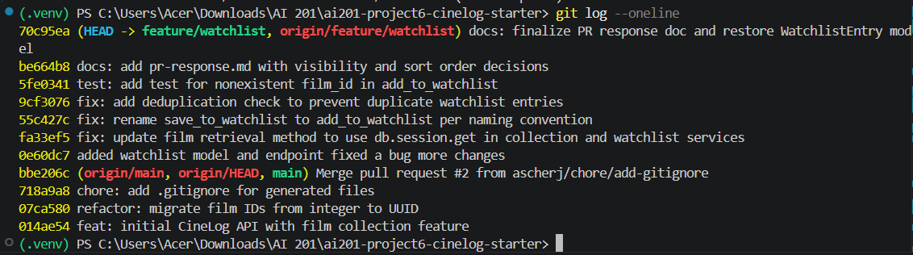

\# PR Response Doc — CineLog Watchlist Feature

\## AI Usage

\*\*I used an AI assistant to help troubleshoot Pytest fixture errors, resolve a tricky Git rebase conflict involving `.gitignore` and missing database models, and format standard markdown documentation for this PR.\*\*

\## Comment 1 — Rename

\*\*What I did: I renamed `save_to_watchlist` to `add_to_watchlist` in `services/watchlist_service.py` and updated the call site in `routes/watchlist/watchlist.py`.\*\*

\*\*How I verified: I used my code editor's global search to search the entire project for `save_to_watchlist` and confirmed that no other call sites were missed.\*\*

\## Comment 2 — Deduplication

\*\*What I did: I added a deduplication check at the top of `add_to_watchlist`. It queries `WatchlistEntry` using the `user_id` and `film_id`. If a duplicate is detected, it raises an error, stopping the function from inserting a second identical record.\*\*

\*\*How I verified: I directly referenced the existing `add_to_collection()` pattern in `services/collection_service.py` to ensure my implementation mirrored how the codebase currently handles this exact edge case.\*\*

\## Comment 3 — Missing test

\*\*What I did: I created a new file `tests/test_watchlist.py` and wrote a test that passes a fake UUID to `add_to_watchlist` to verify it correctly raises a `FilmNotFoundError`.\*\*

\*\*How I verified: I modeled this test directly after `test_add_to_collection_nonexistent_film_raises` from the existing `tests/test_collection.py` file to ensure it targets the correct edge case.\*\*

\## Comment 4 — Default visibility

\*\*My position: I chose to set the default visibility to `public=True`.\*\*

\*\*Reasoning: CineLog is fundamentally a community film tracking app. Defaulting watchlists to public optimizes for social discovery, removing friction for users who want to share their tastes and see what their friends are planning to watch.\*\*

\*\*Tradeoff acknowledged: The alternative (defaulting to private) would optimize for strict user privacy, ensuring no one feels judged for their watch-habits. However, in the context of a community-driven platform, forcing users to manually opt-in to sharing creates too much friction and hurts the core discovery loop.\*\*

\## Comment 5 — Sort order

\*\*My position: I agree with changing the sort order to date-added (newest first).\*\*

\*\*Reasoning: A watchlist is a dynamic behavioral backlog, not a static reference library. When users check their watchlist, they are usually trying to answer "what should I watch tonight?", making the films they most recently heard about and added the highest priority.\*\*

\*\*Engagement with reviewer's point: I agree entirely with @dev-lead. While alphabetical sorting is cleaner for a massive, permanent collection, it fails to support the active, time-sensitive way users interact with a queue of upcoming films. Date-added solves this.\*\*

\## Comment 6 — Rebase

\*\*What conflicted: There were conflicts in `.gitignore` and `models.py`. The `main` branch updated the database models to use UUIDs instead of integers, which accidentally overwrote my `WatchlistEntry` model during the rebase.\*\*

\*\*How I resolved it: I resolved the `.gitignore` duplicate lines and manually restored the `WatchlistEntry` model into `models.py`, ensuring its IDs were updated to match the new `db.String(36)` UUID format from the `main` branch.\*\*

\*\*How I verified no conflict remains: I ran `pytest tests/test_watchlist.py -v` to confirm the restored model works perfectly with the new UUID format and all tests pass.\*\*

## PR Description
This PR introduces the core Watchlist feature, allowing users to queue films they plan to watch. It includes logic for adding to the watchlist, robust deduplication checks to prevent double-entries, and full Pytest coverage for edge cases (like nonexistent film IDs). Default visibility is set to public to encourage social discovery, and the queue sorts by date-added to optimize for finding a movie to watch tonight.

**Manual Testing Steps:**
1. Boot up the app and navigate to a specific film page.
2. Click the new "Add to Watchlist" button.
3. Verify the film appears in your user profile under the Watchlist tab.
4. Attempt to add the exact same film again and verify the UI catches the error and prevents a duplicate entry.
5. Check the Watchlist tab to ensure newer additions appear at the top (date-added sorting).

**Git Log Screenshot:**
